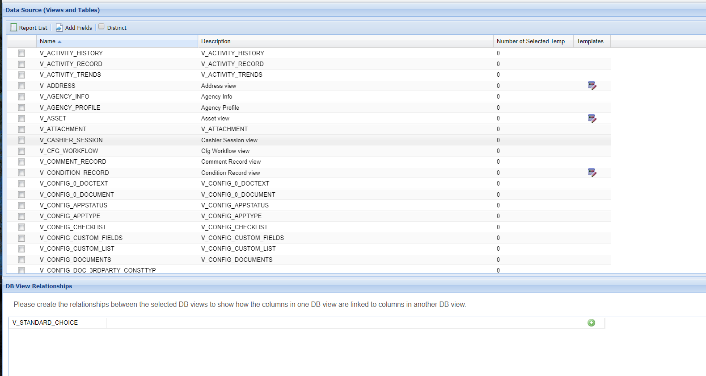
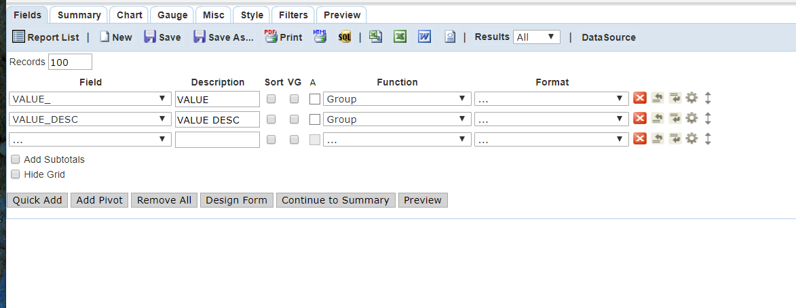
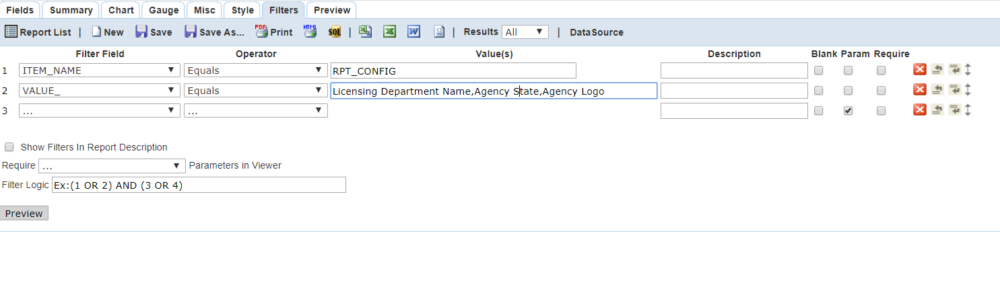

## Report_Header


### Report Name in Ad Hoc Report Writer

Report_Header


### :oil_drum: Data Source


### :label: Fields



### :badminton: Filters



### :bookmark_tabs: Sub Reports

|  Sub Report Name                                                                                       |
|--------------------------------------------------------------------------------------------------------|


### :link: External Css Links 
 
```


```

